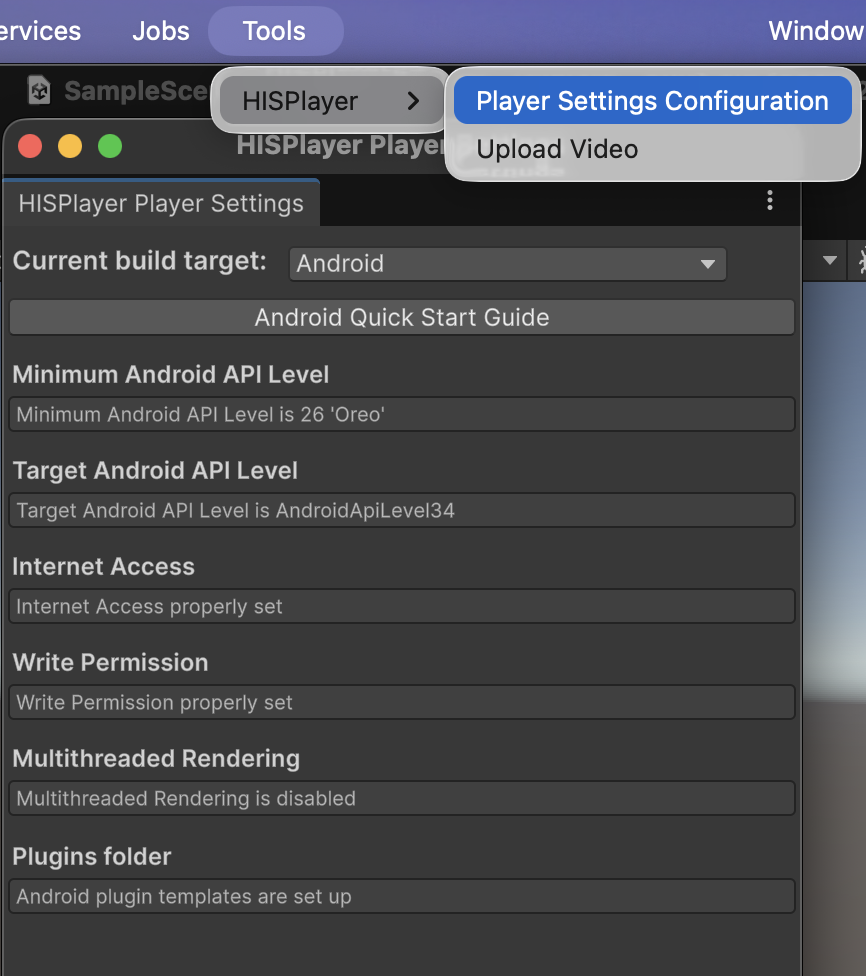
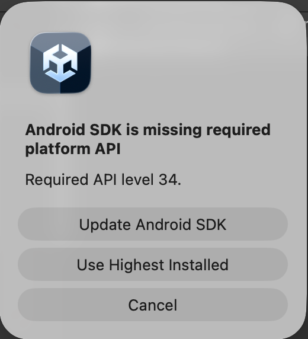

# QuickStart Guide
Getting started with HISPlayer consists of implementing the following steps:

1. Import and configure SDKs

      1.1. Integrate Meta XR All-in-One SDK
 
      1.2. Import package
 
      1.3. Configure Unity for Android
   
2. Meta XR Sample

3. More Information, Features and APIs

## 1.1 Integrate Meta XR All-in-One SDK

Integrate HISPlayer SDK with the **[Meta XR All-in-One SDK](https://developer.oculus.com/downloads/package/meta-xr-sdk-all-in-one-upm/)** or **Meta XR Core SDK** only for smaller package size.

First, please configure the Unity project for Oculus by following this [Tutorial](https://developer.oculus.com/documentation/unity/unity-tutorial-hello-vr/) and open **Window > Package Manager > Packages: In Project** to check Meta XR All-in-One SDK is installed properly.

      

#### Meta XR Setup Tool

Open **Edit > Player Settings > MetaXR**, select the Android platform and clik "**Select All**" and "**Apply All**" in order to set up all the Meta XR settings. 

      

In XR Plug-in Management, please make sure that you have the **OpenXR** option checked (or Oculus for older Meta XR SDK version). Otherwise, when you run the application, it will show a 2D window without XR environment.
  
  - **Edit > Project Settings > XR Plug-in Management**

      

## 1.2 Import HISPlayer SDK

Importing the SDK is the same as importing other normal packages in Unity. 
Select the package of _HISPlayer SDK_ and import it.

**Assets > Import Package > Custom Package > HISPlayer XR SDK unity package**

Select the package of _HISPlayer SDK_ and import it.

      

## 1.3 Configure Unity for Android

Open the window **Tools > HISPlayer** located in the upper side of the screen > Click on Player Settings Configuration > Select **Build Target to Android** > Set all the required settings.

      

Setting **"Plugins folder"** will create **mainTemplate.gradle** and **gradleTemplate.properties** in your ProjectRoot\Assets\Plugins\Android. Please make sure you use the correct **mainTemplate.gradle** that is generated from our SDK. If you need to modify it, please make sure the dependencies and configurations from HISPlayer SDK's mainTemplate.gradle exist in your modified gradle file.

#### Android Target API Level
It is recommended to set Target API Level to 34 or higher. By selecting Android target 34, Unity is going to ask you to update (in the case you don't have the SDK installed). Please, press "Update Android SDK" button.

      

Alternatively, you may set the Target API level to 34 or higher in the Unity project settings.

## 2. Meta XR Sample

Please, download the sample here: [**HISPlayer Meta XR Sample**](https://downloads.hisplayer.com/Unity/Quest/HISPlayer_MetaXR_Sample_1.1.0.unitypackage) (no need to download it if you have received it in the email). 

Before using the sample, please make sure you have followed the above steps to set-up your Unity project for Oculus and HISPlayer SDK. To use the sample, please follow these steps:
  - Set up the [Meta XR All-in-One environment](/setup-guide.md?id=_11-integrate-meta-xr-all-in-one-sdk).
  - Import HISPlayer SDK
  - Import HISPlayer Meta XR Sample
  - Import TextMeshPro. Go to Unity Window > TextMeshPro > Import TMP Essential Resources.
  - If you received a license key from HISPlayer, input the license key through the Inspector Unity window: **StreamController GameObject > HISPlayerSample component > License Key**. This must be done for **each scene** you want to test while adding them to the Scene List. Open each scene located in `Assets/HISPlayerMetaQuestSample/Scenes/`, set the license key if needed, then go to **File > Build Settings > Add Open Scenes** to include it in the **Scene List** of the Build Profile.
  - Build and Run

For more information about the Meta XR sample, please refer to the following [**Meta XR Sample page**](/sample.md).

## 3. More Information, Features and APIs
For more information about the supported features and APIs, please refer to the following [**HISPlayer API**](/hisplayer-api.md).
